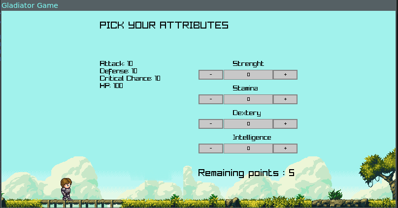

# Gladiator game

This is a working in progress turn based gladiator style game

## Classes
Currently the game has 3 classes

- Mage
- Warrior
- Archer

## Attribute points

Before the game begins (at the character creation screen) you'll be able to set 5 attribute points in any of the following attributes:

- Strenght
- Dextery
- Stamina
- Intelligence
- Luck

Whenever you level up you'll gain 2 more point to add to your attributes.

## Screenshots

## TODO

- [x] Enemy creation service
- [x] Character Attributes set up
- [ ] Finish reading https://gameprogrammingpatterns.com/
- [ ] Character customization
- [ ] Idle sprites
- [ ] UI refactoring (to use clean architecture)
- [ ] Apply Game design patterns
- [ ] Separate server side from client side
- [ ] Update readme with credits for the sprites (LPC)
- [ ] Matchmaking service
- [ ] Mage class implementation
- [ ] Archer class implementation
- [ ] Wearables
- [ ] Consumables
- [ ] Inventory

